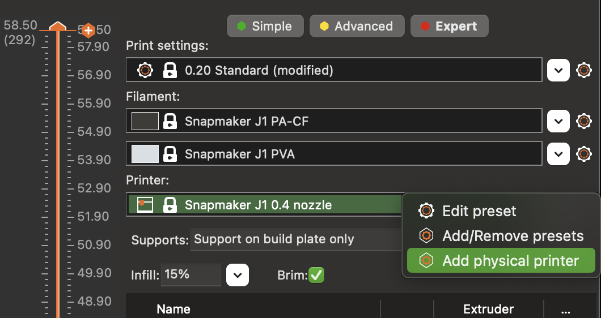
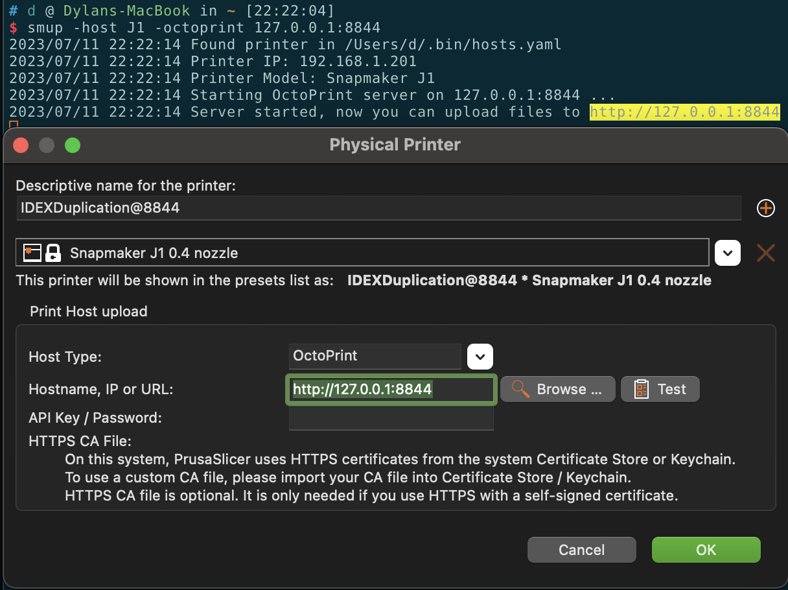

# My 3DP Configs
[]
[Chinese Readme](./README.md)

The unofficial PrusaSlicer and OrcaSlicer print settings provided are personally calibrated by me. Please read the README file in the subdirectory carefully for proper configuration. If you encounter any printing errors, kindly post an issue. Thank you.

> Due to limitations in tested materials and variations in printing environments, it is essential to perform print validation and filament calibration before use.

## How to use

Download [Releases](https://github.com/macdylan/3dp-configs/releases)

I will regularly update them. Since they are unofficial configuration files, they cannot be automatically updated within the slicer software. Please manually download and install them.
Additionally, I am actively reaching out to the maintainers of these projects to expedite their inclusion in the official software release.

### PrusaSlicer

- Open PrusaSlicer and click on the `Help` menu / `Show Configuration Folder`
- Extract the files from zip file and copy all of them to the `vendor` directory. If the destination files already exist, choose to overwrite them.
- Restart PrusaSlicer and click on the `Configuration` menu / `Configuration Assistant (or Wizard)`
- Select Snapmaker from the "Other Vendors" section, click Next, choose the desired printer and filament, then complete the setup.

### OrcaSlicer
> Please note that if you are using the Snapmaker parameters from the official release and have saved modified settings, they will disappear (not lost, as they will still be saved in your personal folder but will not be displayed in the menu).

- Open OrcaSlicer and remove the previously configured Snapmaker device under "Printer" then close the software.
- Navigate to the program installation directory:
  - macOS: /Applications/OrcaSlicer.app/Contents/Resources/profiles/
  - Windows: (locate where the program is installed)/profiles/
- Extract the files from zip file and copy all of them into the directory, choosing to overwrite existing files.
- Restart OrcaSlicer, add the Snapmaker printers under "Printer" and add all the new Snapmaker filaments under "Filament", Your setup is now complete.

### How to send the gcode file to Snapmaker printers via WiFi

Use my other project [sm2uploader](https://github.com/macdylan/sm2uploader), which simulates the API of OctoPrint, you can utilize the physical printer connection feature within the slicer software to send Gcode files to the Snapmaker printer through sm2uploader.

 

